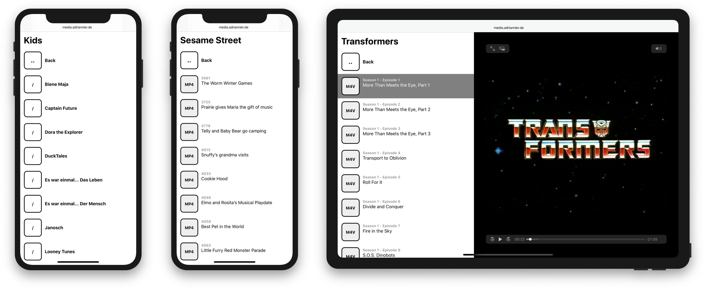

# HTTP Thingie

Generates listings of a directory and its sub-directories outside the public web directory and serves the media files found there. The project’s main goal is to make media files available to a local network where authentication is not necessary. The experience is optimized for users of iOS and iPadOS to browse for movies and ultimately elect to use AirPlay to see them on a larger screen.

## How it works

Loading the `public/index.php` script through a web server will create a listing of the directory specified by the constant `ROOT_DIR` in `thingie.php`. If a symbolic link exists at `public/download` pointing to the same directory then the file will not be served through PHP but directly by the web server. This is especially beneficial for files larger than 2 GB and 32-bit PHP installations.

The web server should be configured so that all non-existing files are re-routed to `public/index.php`.

## How to configure Apache

Setting the web root to `http-thingie/public` and leaving the `public/.htaccess` file in place should be sufficient to route all non-existing requests to `public/index.php`.

## How to configure nginx

Use the included [nginx.conf](nginx.conf) file as a starting point.

## Permissions

If the `DEBUG` constant is set to `true` in `thingie.php` the project’s directory must have the necessary permissions for the web server process to write there.
